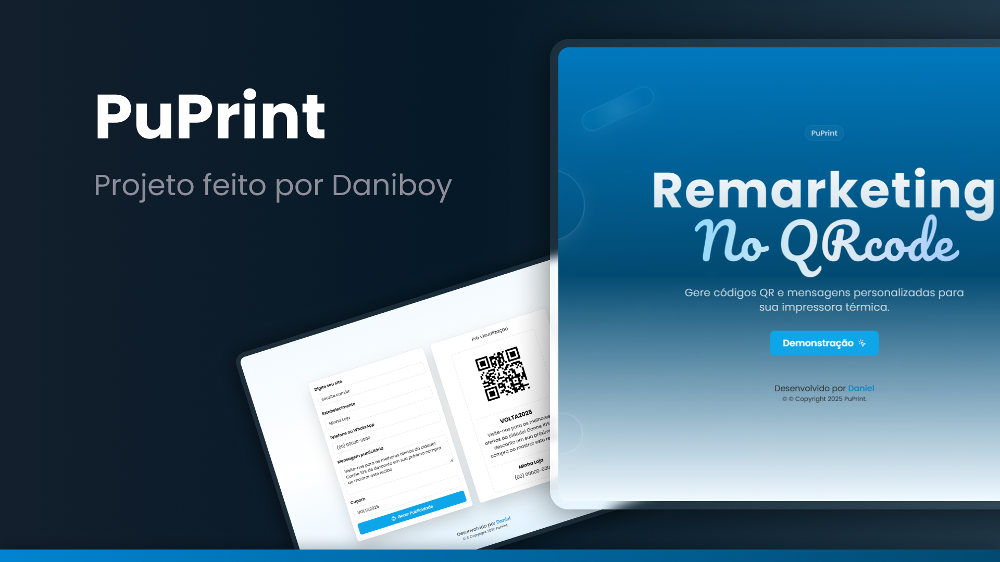

<h1 align="center"> PuPrint </h1>

<p align="center">
Gerador de QRcode e publicidade para impressoras térmicas FoodService<br/>
</p>
<p align="center">
  
</p>

<br>

<p align="center">
  
</p>

## 🚀 Tecnologias

Esse projeto foi desenvolvido com as seguintes tecnologias:

- Tailwind CSS
- JavaScript
- Git e Github
- Typescript
- Next JS
- Shadcn

## 💻 Projeto

O puprit é um gerador de QRcode com foco para impressoras térmicas, quantas vezes você pediu um lanche ou comprou algo e o estabelecimento mandou um bilhetinho na folha de impressora termica.

- [Acesse o projeto finalizado, online](https://danielbragadasilva.github.io/linktree/)

## 🔖 Layout

Você pode visualizar o layout do projeto através [DESSE LINK](https://puprint-c5w6.vercel.app/).

## 📝 Licença

Esse projeto está sob a licença MIT.

---

Feito por ♥ by Daniboy 👋 [Me siga no Linkedin](https://www.linkedin.com/in/daniel-braga-565899128/)


This is a [Next.js](https://nextjs.org) project bootstrapped with [`create-next-app`](https://nextjs.org/docs/app/api-reference/cli/create-next-app).

## Getting Started

First, run the development server:

```bash
npm run dev
# or
yarn dev
# or
pnpm dev
# or
bun dev
```

Open [http://localhost:3000](http://localhost:3000) with your browser to see the result.

You can start editing the page by modifying `app/page.tsx`. The page auto-updates as you edit the file.

This project uses [`next/font`](https://nextjs.org/docs/app/building-your-application/optimizing/fonts) to automatically optimize and load [Geist](https://vercel.com/font), a new font family for Vercel.

## Learn More

To learn more about Next.js, take a look at the following resources:

- [Next.js Documentation](https://nextjs.org/docs) - learn about Next.js features and API.
- [Learn Next.js](https://nextjs.org/learn) - an interactive Next.js tutorial.

You can check out [the Next.js GitHub repository](https://github.com/vercel/next.js) - your feedback and contributions are welcome!

## Deploy on Vercel

The easiest way to deploy your Next.js app is to use the [Vercel Platform](https://vercel.com/new?utm_medium=default-template&filter=next.js&utm_source=create-next-app&utm_campaign=create-next-app-readme) from the creators of Next.js.

Check out our [Next.js deployment documentation](https://nextjs.org/docs/app/building-your-application/deploying) for more details.


