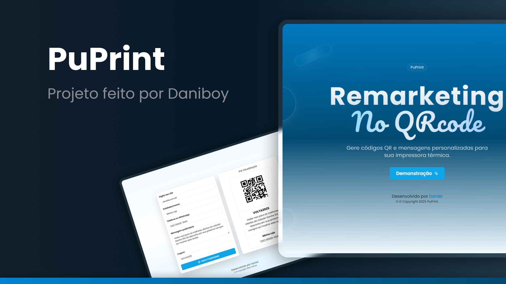

<h1 align="center"> PuPrint </h1>

Gerador de QRcode e publicidade para impressoras térmicas FoodService 

  

 

  

## 🚀 Tecnologias

Esse projeto foi desenvolvido com as seguintes tecnologias:

- Tailwind CSS
- JavaScript
- Git e Github
- Typescript
- Next JS
- Shadcn

## 💻 Projeto

O puprit é um gerador de QRcode com foco para impressoras térmicas, quantas vezes você pediu um lanche ou comprou algo e o estabelecimento mandou um bilhetinho na folha de impressora termica.

- [Acesse o projeto finalizado, online](https://danielbragadasilva.github.io/linktree/)

## 🔖 Layout

Você pode visualizar o layout do projeto através [DESSE LINK](https://www.figma.com/file/iW0uNDoFex0M9QiFT8Vn4P/DevLinks-%E2%80%A2-Projeto-Discover-Daniboy?type=design&node-id=10%3A620&mode=design&t=pgvAz8AxgoYhnwSE-1).

## 📝 Licença

Esse projeto está sob a licença MIT.

---

Feito com ♥ by Daniboy 👋 [Me siga no Linkedin](https://www.linkedin.com/in/daniel-braga-565899128/)
